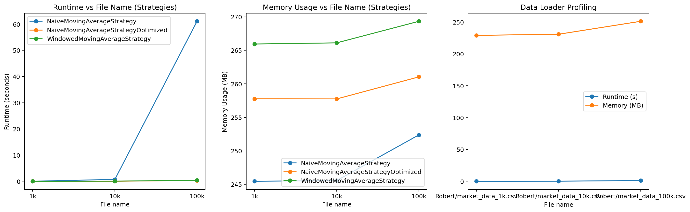

# Complexity Report

## Tables of runtime and memory metrics

### Data loading

| file                        |   load_time_s |   peak_mem_mb |
|:----------------------------|--------------:|--------------:|
| Robert/market_data_1k.csv   |     0.0047656 |       139.359 |
| Robert/market_data_10k.csv  |     0.0472322 |       143.691 |
| Robert/market_data_100k.csv |     0.579225  |       165.125 |

### Strategies

| strategy                            | file   |   run_time_s |   peak_mem_mb |   signals_count |
|:------------------------------------|:-------|-------------:|--------------:|----------------:|
| NaiveMovingAverageStrategy          | 1k     |    0.0058139 |       168.699 |            1001 |
| NaiveMovingAverageStrategy          | 10k    |    0.529815  |       168.641 |           10001 |
| NaiveMovingAverageStrategy          | 100k   |   49.3404    |       174.34  |          100001 |
| NaiveMovingAverageStrategyOptimized | 1k     |    0.0005799 |       180.891 |            1001 |
| NaiveMovingAverageStrategyOptimized | 10k    |    0.0050465 |       178.867 |           10001 |
| NaiveMovingAverageStrategyOptimized | 100k   |    0.0807568 |       182.777 |          100001 |
| WindowedMovingAverageStrategy       | 1k     |    0.0013898 |       187.906 |            1001 |
| WindowedMovingAverageStrategy       | 10k    |    0.0062975 |       188.082 |           10001 |
| WindowedMovingAverageStrategy       | 100k   |    0.220536  |       190.789 |          100001 |

## Plots of scaling behavior



## Comparing strategies and optimization impact

We can see that with few tick the strategy does not matter a lot but when the ticks are increased a bit, they start to matter a lot. 

Runtime shoots up when ticks are increased to 100k for the orginial Naive strategy and for all strategies the memory usage starts to creep up with a 100k ticks. 

We can also see that a little optimization has an impact on the Naive strategy.. 


## Additional profiling: cProfile

```
         7412461 function calls (7395420 primitive calls) in 675.403 seconds

   Ordered by: cumulative time
   List reduced from 1740 to 50 due to restriction <50>

   ncalls  tottime  percall  cumtime  percall filename:lineno(function)
    408/2    0.008    0.000  566.169  283.085 C:\Users\Lenovo\anaconda3\Lib\site-packages\matplotlib\text.py:926(get_window_extent)
       30    0.001    0.000  536.711   17.890 c:\Users\Lenovo\Documents\FinMath UChicago\Coursework\FINM 32500 1 Computing for Finance in Python\Assignment 3\Assignment_3\Robert\profiler.py:11(profile_memory)
       30    1.232    0.041  529.896   17.663 C:\Users\Lenovo\anaconda3\Lib\site-packages\memory_profiler.py:269(memory_usage)
        9    0.332    0.037  453.030   50.337 c:\Users\Lenovo\Documents\FinMath UChicago\Coursework\FINM 32500 1 Computing for Finance in Python\Assignment 3\Assignment_3\Robert\profiler.py:21(run_strategies_memory_check)
      483    0.005    0.000  412.364    0.854 C:\Users\Lenovo\anaconda3\Lib\multiprocessing\connection.py:246(recv)
      483    0.008    0.000  412.354    0.854 C:\Users\Lenovo\anaconda3\Lib\multiprocessing\connection.py:310(_recv_bytes)
      324  412.339    1.273  412.339    1.273 {built-in method _winapi.WaitForMultipleObjects}
       66    0.001    0.000  348.732    5.284 C:\Users\Lenovo\anaconda3\Lib\threading.py:641(wait)
    518/2    0.043    0.000  345.698  172.849 C:\Users\Lenovo\anaconda3\Lib\site-packages\matplotlib\text.py:358(_get_layout)
       66    0.315    0.005  334.542    5.069 C:\Users\Lenovo\anaconda3\Lib\threading.py:327(wait)
      267  110.328    0.413  133.687    0.501 {method 'acquire' of '_thread.lock' objects}
   222049    0.960    0.000  132.502    0.001 c:\Users\Lenovo\Documents\FinMath UChicago\Coursework\FINM 32500 1 Computing for Finance in Python\Assignment 3\Assignment_3\Robert\strategies.py:12(generate_signals)
   224507  131.397    0.001  131.721    0.001 {built-in method builtins.sum}
      103    0.001    0.000   90.172    0.875 C:\Users\Lenovo\anaconda3\Lib\site-packages\tqdm\std.py:110(__enter__)
      829    0.123    0.000   49.023    0.059 C:\Users\Lenovo\anaconda3\Lib\site-packages\tqdm\std.py:102(acquire)
      416    0.003    0.000   10.486    0.025 C:\Users\Lenovo\anaconda3\Lib\multiprocessing\popen_spawn_win32.py:105(wait)
      161    0.002    0.000   10.486    0.065 C:\Users\Lenovo\anaconda3\Lib\multiprocessing\process.py:142(join)
      416   10.482    0.025   10.482    0.025 {built-in method _winapi.WaitForSingleObject}
        9    0.205    0.023    6.619    0.735 c:\Users\Lenovo\Documents\FinMath UChicago\Coursework\FINM 32500 1 Computing for Finance in Python\Assignment 3\Assignment_3\Robert\profiler.py:56(run_strategies_time_check)
       10    0.699    0.070    2.644    0.264 c:\Users\Lenovo\Documents\FinMath UChicago\Coursework\FINM 32500 1 Computing for Finance in Python\Assignment 3\Assignment_3\Robert\data_loader.py:11(read_csv_to_immutable_list)
   235020    0.895    0.000    1.452    0.000 C:\Users\Lenovo\anaconda3\Lib\csv.py:174(__next__)
        3    0.000    0.000    1.280    0.427 c:\Users\Lenovo\Documents\FinMath UChicago\Coursework\FINM 32500 1 Computing for Finance in Python\Assignment 3\Assignment_3\Robert\profiler.py:48(run_data_loader_time_check)
   333018    0.288    0.000    1.180    0.000 C:\Users\Lenovo\anaconda3\Lib\site-packages\tqdm\std.py:1160(__iter__)
      717    0.018    0.000    0.839    0.001 C:\Users\Lenovo\anaconda3\Lib\site-packages\tqdm\std.py:1198(update)
      733    0.008    0.000    0.826    0.001 C:\Users\Lenovo\anaconda3\Lib\site-packages\tqdm\std.py:1325(refresh)
      742    0.006    0.000    0.805    0.001 C:\Users\Lenovo\anaconda3\Lib\site-packages\tqdm\std.py:1464(display)
   222045    0.592    0.000    0.797    0.000 c:\Users\Lenovo\Documents\FinMath UChicago\Coursework\FINM 32500 1 Computing for Finance in Python\Assignment 3\Assignment_3\Robert\strategies.py:36(generate_signals)
      161    0.003    0.000    0.796    0.005 C:\Users\Lenovo\anaconda3\Lib\multiprocessing\process.py:110(start)
      161    0.001    0.000    0.755    0.005 C:\Users\Lenovo\anaconda3\Lib\multiprocessing\context.py:222(_Popen)
      161    0.003    0.000    0.754    0.005 C:\Users\Lenovo\anaconda3\Lib\multiprocessing\context.py:334(_Popen)
      161    0.010    0.000    0.750    0.005 C:\Users\Lenovo\anaconda3\Lib\multiprocessing\popen_spawn_win32.py:46(__init__)
      161    0.658    0.004    0.658    0.004 {built-in method _winapi.CreateProcess}
  1351945    0.458    0.000    0.458    0.000 {method 'append' of 'list' objects}
     2226    0.005    0.000    0.435    0.000 C:\Users\Lenovo\anaconda3\Lib\site-packages\tqdm\utils.py:378(disp_len)
   222051    0.308    0.000    0.428    0.000 c:\Users\Lenovo\Documents\FinMath UChicago\Coursework\FINM 32500 1 Computing for Finance in Python\Assignment 3\Assignment_3\Robert\strategies.py:63(generate_signals)
     2226    0.007    0.000    0.422    0.000 C:\Users\Lenovo\anaconda3\Lib\site-packages\tqdm\utils.py:374(_text_width)
      742    0.006    0.000    0.399    0.001 C:\Users\Lenovo\anaconda3\Lib\site-packages\tqdm\std.py:457(print_status)
      742    0.010    0.000    0.398    0.001 C:\Users\Lenovo\anaconda3\Lib\site-packages\tqdm\std.py:1150(__str__)
      742    0.063    0.000    0.378    0.001 C:\Users\Lenovo\anaconda3\Lib\site-packages\tqdm\std.py:464(format_meter)
239019/238663    0.300    0.000    0.366    0.000 {built-in method builtins.next}
1366252/1366198    0.364    0.000    0.364    0.000 {built-in method builtins.len}
   235010    0.331    0.000    0.331    0.000 <string>:2(__init__)
      132    0.009    0.000    0.320    0.002 C:\Users\Lenovo\anaconda3\Lib\site-packages\matplotlib\axis.py:1287(_update_ticks)
   411174    0.207    0.000    0.302    0.000 C:\Users\Lenovo\anaconda3\Lib\site-packages\tqdm\utils.py:375(<genexpr>)
      742    0.006    0.000    0.211    0.000 C:\Users\Lenovo\anaconda3\Lib\site-packages\tqdm\std.py:451(fp_write)
     1502    0.004    0.000    0.206    0.000 C:\Users\Lenovo\anaconda3\Lib\site-packages\tqdm\utils.py:194(inner)
        1    0.000    0.000    0.206    0.206 C:\Users\Lenovo\anaconda3\Lib\site-packages\matplotlib\image.py:1508(imsave)
        1    0.000    0.000    0.206    0.206 C:\Users\Lenovo\anaconda3\Lib\site-packages\PIL\Image.py:2509(save)
        1    0.000    0.000    0.201    0.201 C:\Users\Lenovo\anaconda3\Lib\site-packages\PIL\PngImagePlugin.py:1300(_save)
        1    0.000    0.000    0.201    0.201 C:\Users\Lenovo\anaconda3\Lib\site-packages\PIL\ImageFile.py:535(_save)


```
